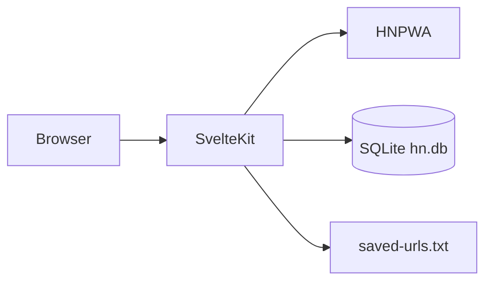

# Upgrading a fork to the SQLite-backed version

This document helps an AI or human upgrade an older **pure-frontend** fork of hacker-newsy (SvelteKit + HNPWA only) to this version, which adds **server-side SQLite** and **API routes**.

## What changed (architecture)

1. **Before**: All data came from `https://api.hnpwa.com` in `load` functions and client `fetch`. No persistence.
2. **After**: The same HNPWA integration remains for stories/comments. **Personal state** lives in SQLite on the Node server:
   - Read article IDs
   - Highlight patterns (substring match on title/domain)
   - Saved article URLs (also written to `data/saved-urls.txt`)



## New dependencies

- **Runtime**: `better-sqlite3` (native addon; Docker/Alpine needs build tools during `yarn install`).

## New / important files

| Path | Role |
|------|------|
| `src/hooks.server.ts` | Request logging; `handleError` logs stack server-side |
| `src/lib/server/env.ts` | `DEBUG`, `DB_PATH`, saved-file path helpers |
| `src/lib/server/logger.ts` | Structured logs (JSON when `NODE_ENV=production`) |
| `src/lib/server/db.ts` | Schema, queries, `exportSavedUrls()` (on-demand export) |
| `src/routes/+layout.server.ts` | Loads `readIds`, `savedIds`, `highlightPatterns` for the UI |
| `src/routes/api/read/+server.ts` | `GET` / `POST` read state |
| `src/routes/api/highlights/+server.ts` | `GET` / `POST` patterns |
| `src/routes/api/highlights/[id]/+server.ts` | `DELETE` pattern |
| `src/routes/api/saved/+server.ts` | `GET` / `POST` saved URLs |
| `src/routes/api/saved/[id]/+server.ts` | `DELETE` saved |
| `src/lib/stores/userState.ts` | Client stores + `invalidateAll()` after settings mutations |
| `src/lib/components/ArticleRow.svelte` | Dim read, highlight ring, swipe / bookmark save |
| `vite.config.ts` | `ssr.external: ['better-sqlite3']` |
| `entrypoint.sh` | Docker `PUID`/`PGID` via `su-exec` |
| `Dockerfile` | Native build deps; production `yarn install`; entrypoint |
| `docker-compose.example.yml` | Example deployment |
| `Makefile` | `make dev` (port 5174), `make clean`, Docker helpers |

## Database schema

```sql
read_articles(article_id PK, read_at)
highlight_patterns(id PK, pattern UNIQUE, created_at)
saved_articles(article_id PK, url, title, saved_at)
```

## Step-by-step merge checklist

1. Add `better-sqlite3` to `dependencies` in `package.json`; keep `ssr.external` in `vite.config.ts`.
2. Copy `src/lib/server/*`, `src/hooks.server.ts`, and `src/routes/api/**`.
3. Add `src/routes/+layout.server.ts` and extend `App.LayoutData` in `src/app.d.ts`.
4. Wire `+layout.svelte` to `syncUserStateFromServer(data)`.
5. Replace list markup in `src/routes/[category=category]/+page.svelte` with `ArticleRow` (or port equivalent UX).
6. Extend `settings.svelte` with highlights tab + API calls + `invalidateAll()`.
7. Mark reads on item view (`item/[id]/+page.svelte` `onMount`) and on list title click (`markReadClient`).
8. Update Docker/Makefile/docs as needed.
9. Run `yarn check`, `yarn build`, `yarn test`.

## Pitfalls

- **Native module**: Local `yarn install` needs a compiler toolchain; Docker build stage uses `python3`, `make`, `g++` on Alpine.
- **Adapter-node**: Production still runs `node build/index.js`; `node_modules` must include `better-sqlite3` (this Dockerfile runs `yarn install --production` in the run stage).
- **Tests**: Vitest uses `DB_PATH=:memory:` via `vite.config.ts`. Playwright uses `tests/.playwright-data/hn.db` (see `playwright.config.ts` + `tests/global-setup.ts`).
